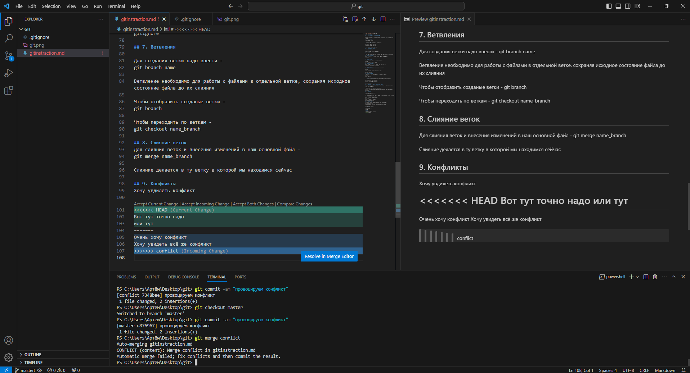
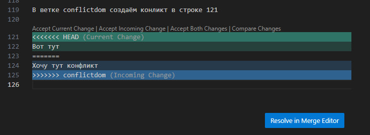
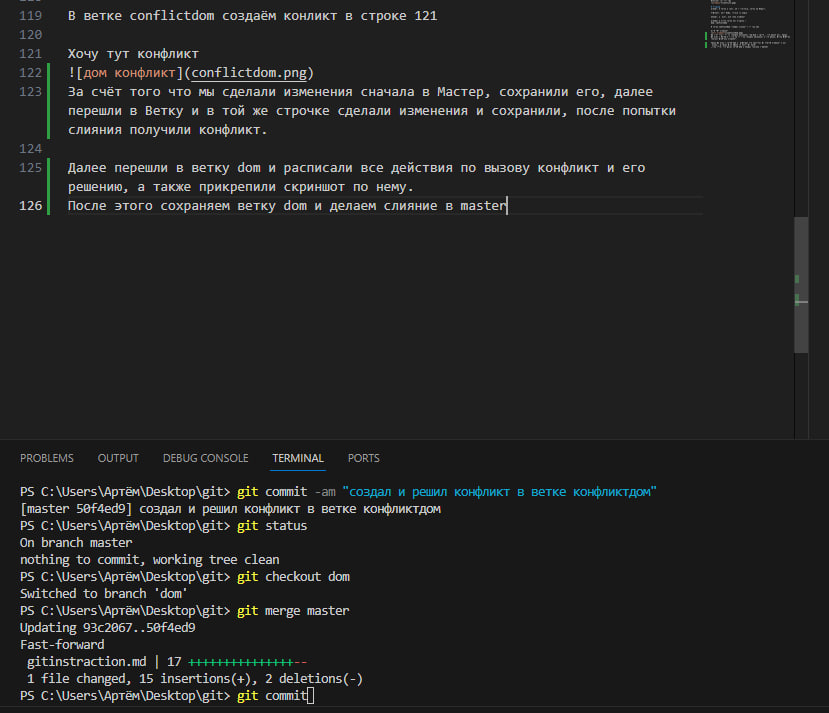

# инструкция по Гит

## 1. Проверка наличия установленного Git

В терменале выполняем команду git version.
Если гит установлен то появится сообщения с информацией о версии файла, иначе ошибка

## 2. Установка Git
Установка Гит с сайта

## 3. Настройка Git
При первом использовани надо представиться -

git config --global user.name

git config --global user.email

Для проверки - git config --list

## 4. Иницилизация Репозитория

Прописываем git init.

В исходной папке появится папка .git

## 5. Домашка

Описать git status / git add / git commit / git log / git diff / git checkout

## Описание git status
Чтобы проверить что происходит с нашим репозиторием пропишем -

git status

## Описание git add
Для добавляения  файла к отслеживанию пропишем -

git add 
и таб нажимаем до нужного файла

## Описание git commit
Чтобы сохранить то что мы прописали ранее надо вписать -

git commit -am "Указываем комментарий"

## Описание git log
Для того чтобы проверить все сохранения можем ввести -

git log

Чтобы посмотреть это всё в коротком варианте -

git log --oneline

## Описание git diff
Показывать то что у нас добавилось, что удалилось введём -
git diff

Чтобы выйти - Q

## Описание git checkout
Переходим в коммит который заполнили ранее для просмотра комментария -

git checkout и прописываем commit

Для того чтобы вернуться пропишем -

git checkout master

## 6. Добавление картинок и игнорирование файлов

Для того чтобы размезстить картнку, её нужно добавить в папку, далее в нужном месте пишем следующее -

![подпись картинки] (название с расширением)

Для того чтобы убрать файл с картинками из отслеживания надо создать файл - .gitignore

## 7. Ветвления

Для создания ветки надо ввести - 
git branch name

Ветвление необходимо для работы с файлами в отдельной ветке, сохраняя исходное состояние файла до их слияния 

Чтобы отобразить созданые ветки - 
git branch

Чтобы переходить по веткам -
git checkout name_branch

## 8. Слияние веток
Для слияния веток и внесения изменений в наш основной файл -
git merge name_branch

Слияние делается в ту ветку в которой мы находимся сейчас

## 9. Конфликты
Хочу увдилеть конфликт

Очень хочу конфликт
Хочу увидеть всё же конфликт

Конфликты возникают при слиянии двух веток в одну, при этом должны быть изменения в одной и той же строчке

Выглядит оно вот так

# Домашка
**Создать 4 ветки и слить их с основной, ветки не удалять**

**Дополнить инструкцию своими скринами**

**Сделать и решить ещё один конфликт**

Создаём 2 новые ветки для домашки - 
dom, conflictdom

В ветке conflictdom создаём конликт в строке 121

Хочу тут конфликт

За счёт того что мы сделали изменения сначала в Мастер, сохранили его, далее перешли в Ветку и в той же строчке сделали изменения и сохранили, после попытки слияния получили конфликт.

Далее перешли в ветку dom и расписали все действия по вызову конфликт и его решению, а также прикрепили скриншот по нему. 
После этого сохраняем ветку dom и делаем слияние в master

Произвели слияние в master и демонстрация этого

## 10. Удалённый репозиторий
Описание pull - Для слития всех данных с удалённого репозитория. 

Описание clone - Добавляет новый удалённый репозиторий по указанному URL в свою локальную рабочую область

Описание push - для того чтобы отправить в удалённый репозиторий свои изменения мы используем - git push / если жалуется, следуем указанием от Гита

Описание pull request - Это используем для принятия изменений в нашем удалённом репозитории

Описание fork - создание ветвления в проекте, для работы в своей ветке и не получения звания Мастер среди коллег